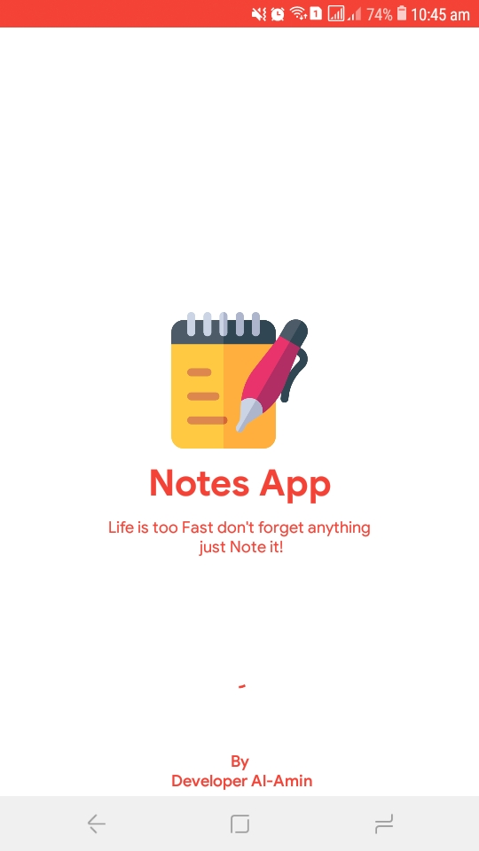
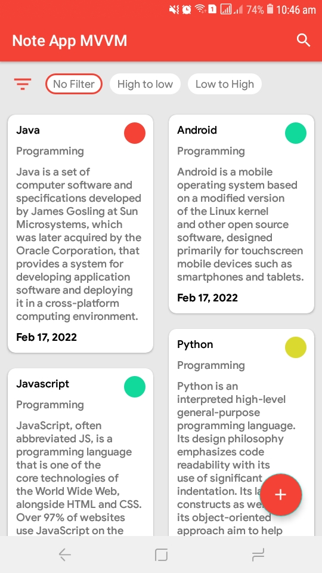
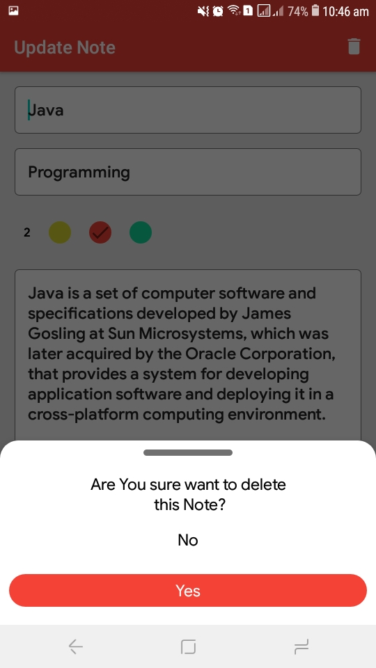

## General
Notes app using Room database & MVVM Architecture

<a id="raw-url" href="Notes App MVVM.apk/?raw=true">
</a>


## Screenshots

|                                       Splash Screen                |                            Notes                            |                            Update & Delete                             |
| :------------------------------------------------------------------: | :-----------------------------------------------------------------: | :------------------------------------------------------------------: |
|   |  |   |


## Dependencies 

- Room Database Dependencies

```
implementation "androidx.room:room-runtime:2.4.1"
annotationProcessor "androidx.room:room-compiler:2.4.1"

```

- Android Architecture Components

```
def lifecycle_version = "2.3.1"
implementation "androidx.lifecycle:lifecycle-livedata:$lifecycle_version"
implementation "android.arch.lifecycle:extensions:1.1.1"
```
